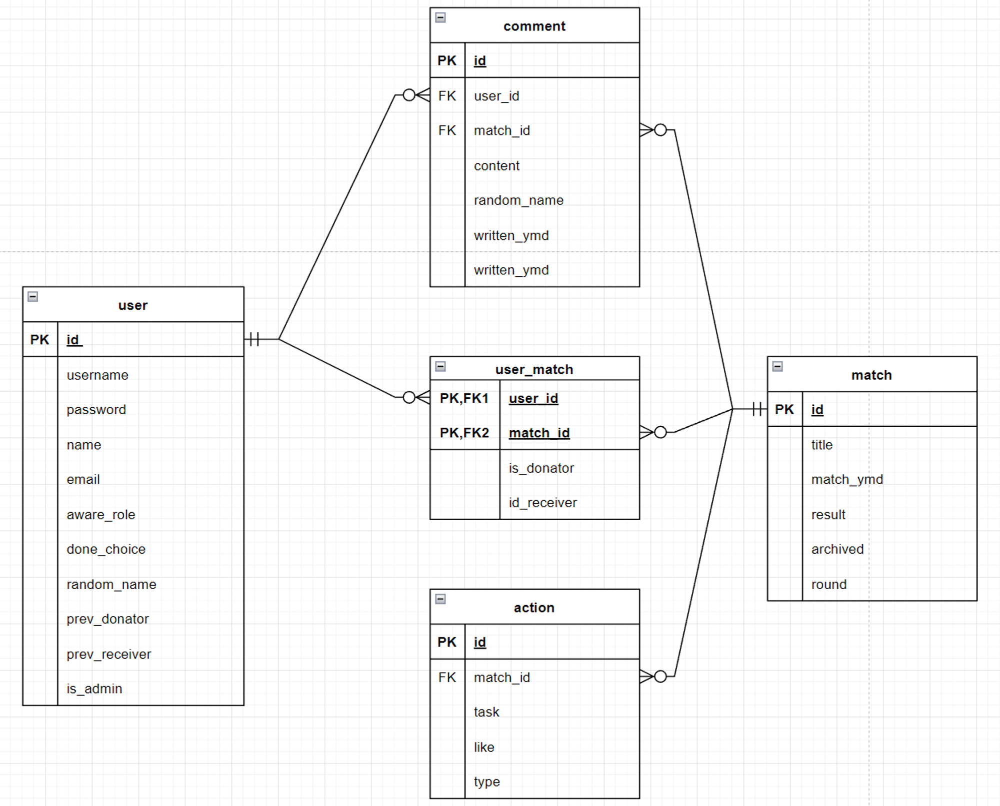
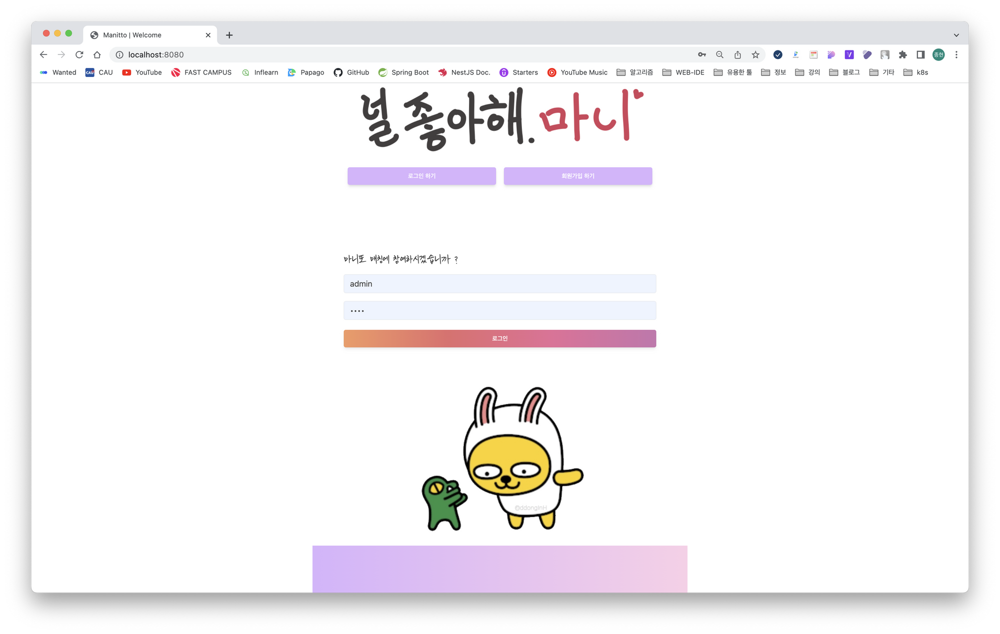
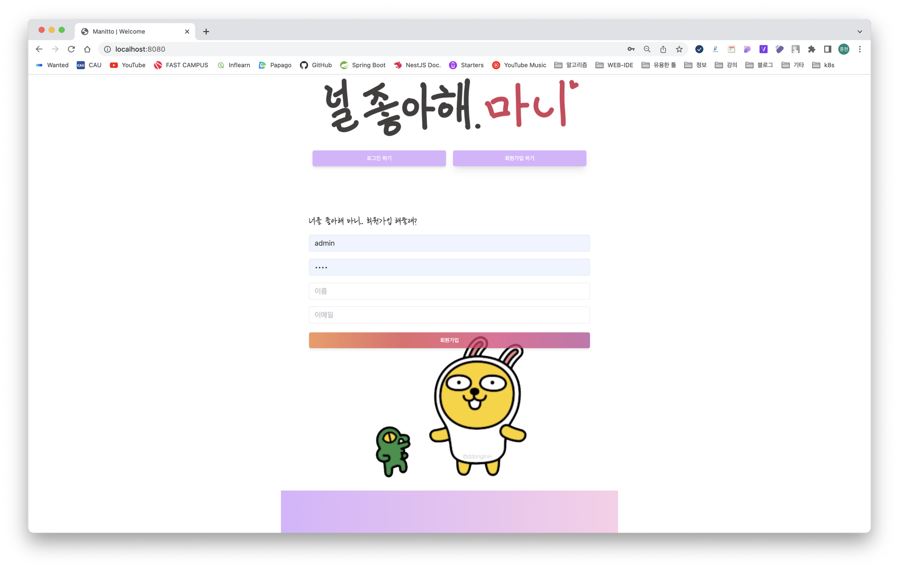
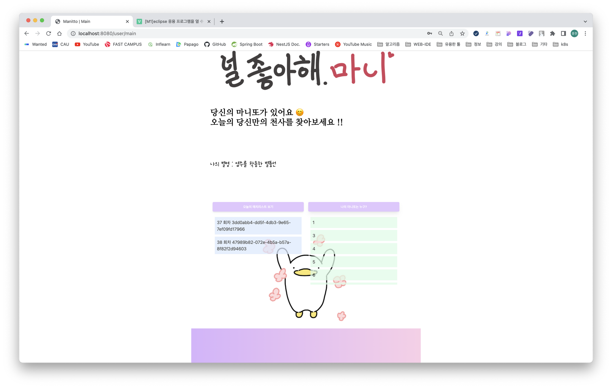
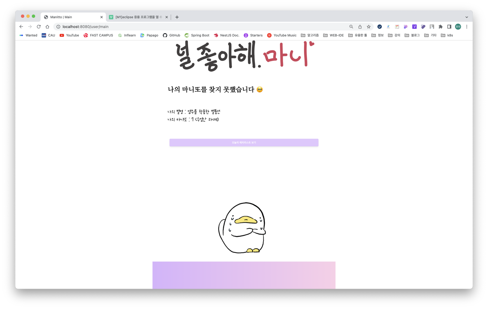
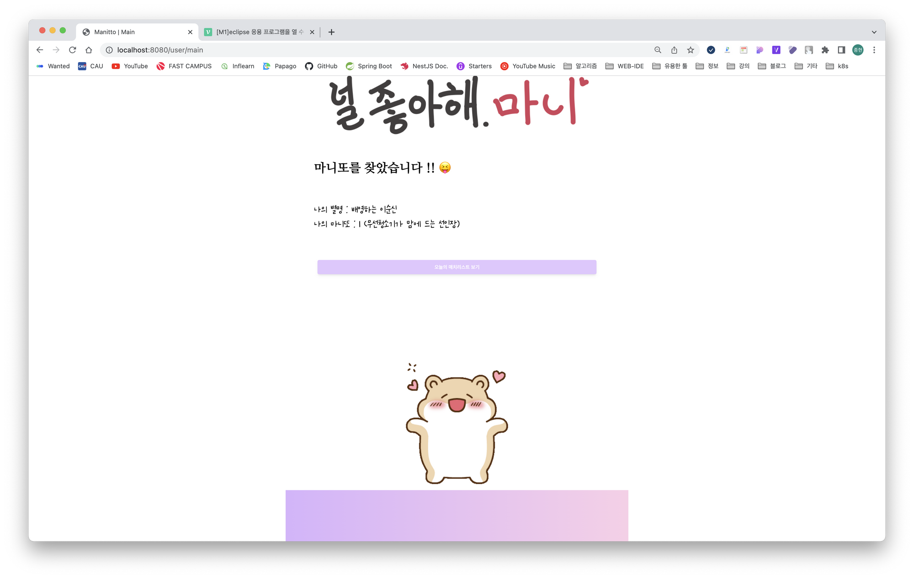
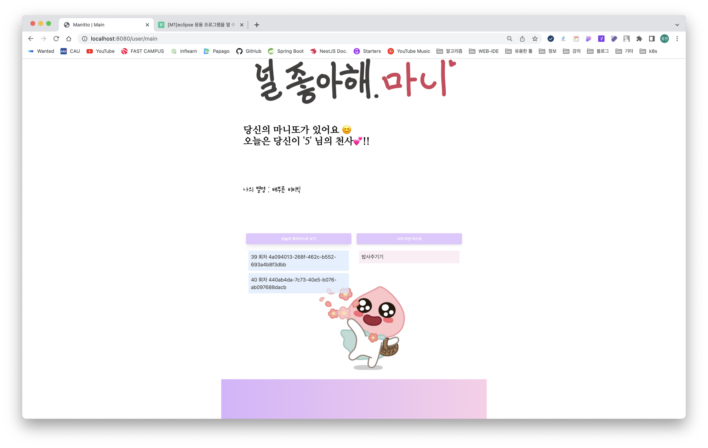
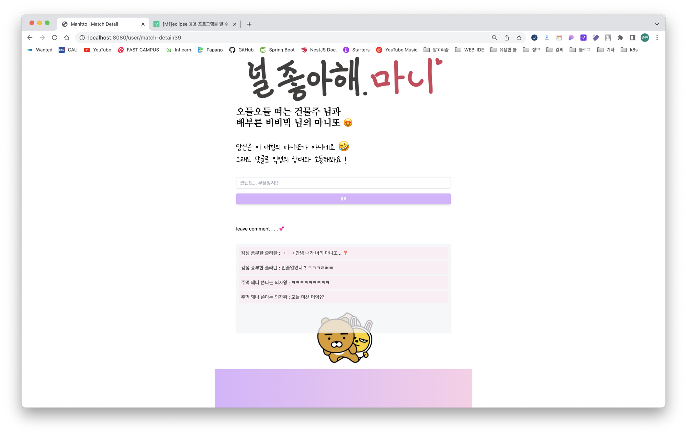

# 미니 프로젝트 (1/24 ~ 1/26)

교육과정에서 스프링 MVC 및 Mybatis(SQL Mapper Framework)를 마무리 하고 과제의 성격으로 미니 프로젝트를 진행하게 되었다. 그리고 어쩌다 보니 이 프로젝트에서 조장을 맡게 되었다. 3일이라는 기간이 주어진다고 하였고, 거기다 일정이 넉넉하지 않아 완전한 애플리케이션을 완성시키기에는 무리가 있을 것으로 판단,  조원들과 프로젝트가 시작되기 전에 몇 차례 회의를 진행하게 되었다.

## 1차 회의 - 프로젝트 주제 선정

### 미니 프로젝트 고려사항

- 일단 시간이 짧다, 문제가 생겨서 해결하지 못하면 엎어질 가능성이 다분하다. 최대한 단순한 주제로!!
- 도메인과 계층을 명확하게 구분하여 코드를 작성하도록 노력하고(Higher Coherence, Loose Coupling)  효율적으로 각자의 역할을 할 수 있도록 한다
- 가급적 과정에서 배운 내용에서 벗어나지 않도록

위의 고려사항을 만족하며 팀원들과 상의하게 된 프로젝트 주제가 **마니또 애플리케이션,**

이 주제를 선정하게 된 근거는 우선 마니또라는 게임이 모두가 직관적으로 이해하기 쉽다고 생각해서였고, 또한 단순히 게시판을 구현하는것 보다는 누군가가 호기심을 가질만한  서비스를 이번기회에 만들어 볼 수 있으면 어떨까 하는 의견에 모든 조원들이 동의하였다.

## 2차 회의 - 프로젝트 개념 구체화 및 명세서 작성

다음 회의에서는 마니또 서비스라는 것을 어떻게 구체화 할 것 인지에 대해 이야기 하였고, 부가적인 기능을 제외한 필수 기능들에 대한 명세를 작성하게 되었다.

**프로젝트 공유 GitHub Public Repository**

- 프로젝트 공유자 : 박종현

- url : https://github.com/zezeg2/manitto

- ## 팀 멤버

### 개발환경

- JDK : oracle-jdk17
- Spring Boot : Spring Boot 3.0.1
- 관계형 데이터베이스 : Maria DB
- 데이터베이스 클라이언트 : 자유선택
- IDE : STS4 / IntelliJ
- 프론트엔드 : JSP, AJAX를 통한 브라우저 - REST-API 서버 통신

### 마니또 애플리케이션이 제공하는 서비스

- 마니또 서비스에 가입하면 회원들 중 임의로 매칭이 발생한다
- 매칭은 N쌍의 마니또가 매칭이 발생하며 애플리케이션이 실행되는 시점 혹은 매일 특정한 시간에 갱신된다
- 매칭이 갱신되면 모든 유저들은 익명의 이름이 갱신되고, 익명의 이름이 서로에게 노출된다.
- 관리자에 의해 매칭에 대한 Action(Mission, Reward, Penalty)이 등록된다
- 마니또로 매칭되게 되면 Receiver는 새로운 매칭이 발생하기 전에 누가 자신의 마니또인지 맞춰야 하고, Contributor는 주어진 미션을 수행해야 한다.
- 매칭은 하나의 포스트 처럼 간주되어 익명의 이름으로 모든 사용자들이 코멘트를 남기며 소통할 수 있다.
- 사용자의 역할에 따라 동적으로 페이지를 로드하여 재미요소를 추가한다.

### 테이블 설계

- ERDiagram

	

- schema.sql

	```sql
	create table user
	(
	    id               int primary key auto_increment,
	    username         varchar(30) unique         not null,
	    password         varchar(255)               not null,
	    name             varchar(30)                not null,
	    email            varchar(30) unique         not null,
	    random_name      varchar(30) default null,
	    role             varchar(30) default 'none' not null,
	    aware_role       boolean     default false  not null,
	    prev_contributor boolean     default false  not null,
	    prev_receiver    boolean     default false  not null,
	    is_admin         boolean     default false  not null
	);
	create table `match`
	(
	    id        int primary key auto_increment,
	    title     varchar(255)               not null,
	    match_ymd date         default now() not null,
	    round     int                        not null,
	    `status`  varchar(100) default false not null,
	    result    boolean      default null
	);
	
	create table user_match
	(
	    id             int primary key auto_increment,
	    user_id        int                   not null,
	    match_id       int                   not null,
	    is_contributor boolean default false not null,
	    is_receiver    boolean default false not null,
	    constraint foreign key (user_id) references user (id),
	    constraint foreign key (match_id) references `match` (id)
	);
	
	create table action
	(
	    id             int primary key auto_increment,
	    type           varchar(100)  not null,
	    match_id       int           not null,
	    task           text          not null,
	    recommendation int default 0 not null,
	    constraint foreign key (match_id) references `match` (id)
	);
	
	create table comment
	(
	    id       int primary key auto_increment,
	    user_id  int                    not null,
	    match_id int                    not null,
	    writer   varchar(30)            not null,
	    content  text                   not null,
	    write_at datetime default now() not null,
	    edited   boolean  default false not null,
	    constraint foreign key (user_id) references user (id),
	    constraint foreign key (match_id) references `match` (id)
	);
	```

### Pages

- Index Page (”/”)
	- 로그인, 회원가입 폼
- Main Page (”/user/main”)
	- admin User : Action 등록, 전체 회원 정보 조회
	- common : 역할 확인(세션), 매치 리스트 쿼리
	- contributor : 액션(Mission)리스트 쿼리
	- receiver : 마니또 정답 맞추기(유저 리스트 쿼리)
		- 정답 시 액션(Reward) 쿼리
		- 오답 시 액션(Penalty) 쿼리
- Match Detail ( (”/user/match-detail/{matchId}”))
	- 댓글 작성 폼, 댓글 리스트

### Scheduler

- 매칭 Generation → 애플리케이션 실행시(Fixed Delay), 매일 9시(Cron)
	1. 기존 매칭 아카이빙(active → archive)
	2. 유저 역할 초기화
	3. 유저 역할 재할당 , 매칭 활성화(wating → activate) 새로운 UserMatch 생성
	4. 대기상태 매치 생성

### REST API

- User`("/api/user")`

	|                 | MethodName      | ReturnType         | ArgsType                 | Method | Mapping |
	| --------------- | --------------- | ------------------ | ------------------------ | ------ | ------- |
	| 유저생성        | registerUser    | void               | User.CreateDto createDto | POST   | /       |
	| 로그인          | login           | void               | User.AuthDto authDto     | POST   | /login  |
	| 로그아웃        | logout          | void               |                          | GET    | /logout |
	| 유저 정보리스트 | getUserInfoList | List<User.InfoDto> |                          | GET    | /list   |
	| 유저 정보 확인  | getUserInfo     | User.InfoDto       | long id                  | GET    | /{id}   |

- Match`("/api/match")`

	|                          | MethodName         | ReturnType          | ArgsType | Method | Mapping |
	| ------------------------ | ------------------ | ------------------- | -------- | ------ | ------- |
	| 활성상태 매치 정보리스트 | getMatchListActive | List<Match.InfoDto> |          | GET    | /list   |

- UserMatch`("/api/user-match")`

	|                      | MethodName      | ReturnType              | ArgsType | Method | Mapping |
	| -------------------- | --------------- | ----------------------- | -------- | ------ | ------- |
	| 유저-매치 정보리스트 | getUserInfoList | List<UserMatch.InfoDto> |          | GET    | /list   |

- Action`("/api/action")`

	|                 | MethodName     | ReturnType           | ArgsType                   | Method | Mapping       |
	| --------------- | -------------- | -------------------- | -------------------------- | ------ | ------------- |
	| 액션 생성       | createAction   | void                 | Action.CreateDto createDto | POST   | /             |
	| 미션 정보리스트 | getMissionList | List<Action.InfoDto> |                            | GET    | /mission-list |

- Comment`("/api/comment")`

	|                 | MethodName   | ReturnType            | ArgsType                   | Method | Mapping |
	| --------------- | ------------ | --------------------- | -------------------------- | ------ | ------- |
	| 댓글 생성       | registerUser | void                  | Action.CreateDto createDto | POST   | /       |
	| 댓글 정보리스트 | login        | List<Comment.InfoDto> |                            | POST   | /login  |

## Result(1/27)

### Index Page

- login



- register



### MainPage

- receiver








- contributor

	


- none


- match-detail

	